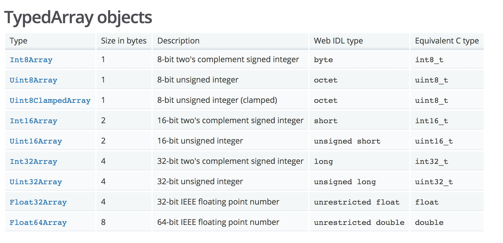

# buffer学习

[Node.jsbuffer](https://github.com/nodejs/node/blob/master/doc/api/buffer.md)

## 基础

>  

ES6引入TypedArray,而buffer类实现了Unit8Array,适用Node.js的使用场景。

Buffer实例和整数数组类似，但是大小固定，并且属于V8的堆外内存。

Buffer是Node.js的全局类，因此不需要require('buffer')来引入。

> 数据存储采用16进制标示

## Buffer方法演进

 > Node版本6之前创建Buffer需要通过Buffer构造函数

```javaScript
    new Buffer([number|| string || array || ArrayBuffer])
```
> 不同的参数类型将导致return的结果不同。

> 所以为了让Buffer实例更可靠,以前的构造函数形式被以下的形式代替。

```javaScript
  Buffer.from(),Buffer.alloc(),Buffer.allocUnsafe()
```

* [`Buffer.from(array)`]=>

     a new `Buffer` containing a *copy* of the provided octets.

* [`Buffer.from(arrayBuffer[, byteOffset [, length]])`]=>

  returns a new `Buffer` that *shares* the same allocated memory as the given [`ArrayBuffer`].

* [`Buffer.from(buffer)`] =>

  returns a new `Buffer` containing a *copy* of the contents of the given `Buffer`.

* [`Buffer.from(string[, encoding])`][`Buffer.from(string)`] =>

  returns a new `Buffer` containing a *copy* of the provided string.

* [`Buffer.alloc(size[, fill[, encoding]])`][`Buffer.alloc()`] =>

  returns a "filled" `Buffer` instance of the specified size.
  This method can be significantly slower than [`Buffer.allocUnsafe(size)`][`Buffer.allocUnsafe()`] but ensures
  that newly created `Buffer` instances never contain old and potentially
  sensitive data.


## Buffer和字符串encoding

> Buffer instances are commonly used to represent sequences
> of encoded characters such as UTF-8, UCS2, Base64 or even Hex-encoded data

## Buffers and ES6 iteration

> Buffer instances can be iterated over using the ECMAScript 2015 (ES6) for..of syntax.


## Buffer方法

- Buffer.byteLength(string[, encoding])

> Returns: {integer} The number of bytes contained within string

- Buffer.compare(buf1, buf2)

> Returns: {integer}

- Buffer.concat(list[, totalLength])

> 尽量手写totalLength，避免程序为了计算totalLength，再进行loop
>  truncated to totalLength
> Returns: {Buffer}

- Buffer.isBuffer(obj)

> obj {Object}
> Returns: {boolean}

- Buffer.isEncoding(encoding)

> encoding {string} A character encoding name to check
> Returns: {boolean}


- buf[index]

- buf.buffer

>  references the underlying ArrayBuffer object based on which this Buffer object is created

- buf.entries()

> Returns: {Iterator}

- buf.indexOf(value[, byteOffset][, encoding])

- buf.keys()

- buf.length


